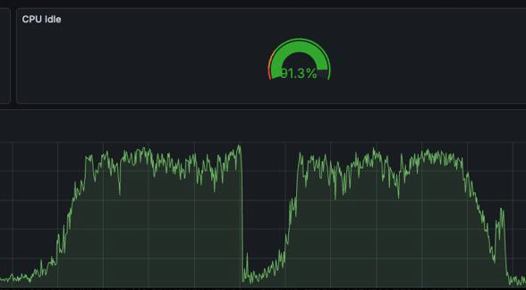
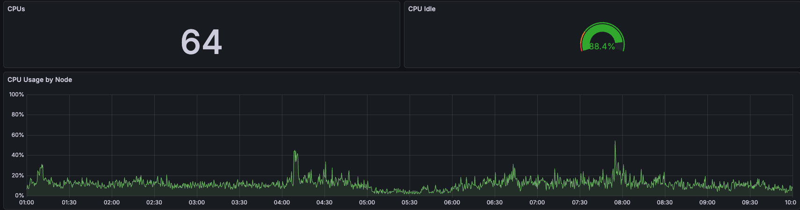

# fasttrun

> English version is available: [README_EN.md](README_EN.md)

Расширение для PostgreSQL 16 / 17 / 18.

Быстрый `TRUNCATE` и `ANALYZE` для временных таблиц — **без единого сообщения инвалидации** в общую очередь (sinval).

## Зачем это нужно

В крупных PL/pgSQL-расчётах временные таблицы используются как промежуточные буферы: создал → наполнил → посчитал → очистил → наполнил снова. Каждый `TRUNCATE` в PostgreSQL проходит через `smgrtruncate` → `CacheInvalidateSmgr` и кладёт сообщение в общую очередь инвалидации (sinval). А каждый `ANALYZE` — ещё хуже: пишет в `pg_class` и `pg_statistic`, порождая десятки sinval-сообщений на одну таблицу.

Когда 50-100 бэкендов параллельно крутят этот цикл — тысячи `TRUNCATE` и `ANALYZE` в секунду — очередь sinval (4096 слотов) переполняется. Каждый бэкенд при любом обращении к каталогу вынужден обработать всю накопившуюся очередь в `ReceiveSharedInvalidMessages`, причём 99% сообщений относятся к чужим временным таблицам и нашему бэкенду бесполезны. На сервере с 60+ ядрами это выливается в спираль O(N²) и съедает всё CPU.

Данный форк fasttrun это попытка решить обе проблемы:
* **`fasttruncate`** — физическая очистка через прямой `unlink` + `smgrcreate`, минуя `smgrtruncate`. Ноль sinval.
* **`fasttrun_analyze`** — подсчёт строк и сбор статистики колонок только в памяти текущего процесса. Ноль записей в каталог, ноль sinval. Максимальная "похожесть" на обычный `ANALYZE`.

## Функции

| Функция | Что делает | sinval? |
|---|---|---|
| `fasttruncate(text)` | Очищает временную таблицу (heap + индексы + toast) | **нет** |
| `fasttrun_analyze(text)` | Публикует `relpages/reltuples` + собирает статистику колонок | **нет** |
| `fasttrun_collect_stats(text)` | Явный сбор статистики колонок. В 99% случаев достаточно `fasttrun_analyze` — он делает то же самое автоматически при первом проходе. Эта функция нужна только если автосбор отключён (`auto_collect_stats=off`) или хочется принудительно пересобрать статистику | **нет** |
| `fasttrun_relstats(text)` | Возвращает текущие `relpages/reltuples` из памяти процесса | **нет** |
| `fasttrun_inspect_stats(text)` | Возвращает кешированные statsTuple в формате `pg_statistic` (для отладки) | **нет** |
| `fasttrun_hot_temp_tables(n)` | Top-N самых создаваемых temp tables (требует `shared_preload_libraries`) | **нет** |
| `fasttrun_prewarm()` | Создаёт top-N горячих temp tables через `create_temp_table` | **нет** |
| `fasttrun_reset_temp_stats()` | Сбрасывает счётчики создания temp tables | **нет** |

Функции, которые принимают имя временной таблицы:
* принимают имя временной таблицы (можно с указанием схемы);
* молча возвращают пустой результат, если таблицы нет;
* выдают ошибку, если таблица не временная.

## Как работает fasttruncate

По умолчанию (`fasttrun.zero_sinval_truncate = on`) физическая очистка идёт через `unlink` файлов всех fork'ов таблицы + повторный `smgrcreate`. Это **не** вызывает `CacheInvalidateSmgr` — в отличие от штатного `smgrtruncate`.

Безопасно потому, что временные таблицы живут в локальном буферном пуле бэкенда. Другие процессы не видят наш relfilenode, и инвалидация им бесполезна.

При этом `fasttruncate` локально сбрасывает кэш планов текущего бэкенда. Это нужно, чтобы PL/pgSQL / SPI не переиспользовал старый план после очистки и повторного наполнения таблицы. В общую очередь sinval этот шаг ничего не пишет.

Помимо самой таблицы, `fasttruncate` обрабатывает:
* **все индексы** — пересоздаёт через `ambuild` (metapage btree, hash и т.д.);
* **toast-таблицу** и её индекс — тот же путь;
* **`rd_amcache`** — очищает кэш метаданных индексного AM;
* **`smgr_cached_nblocks`** — инвалидирует после ambuild;
* **analyze-кэш** — засеивает baseline для дельта-математики.

Перед очисткой вызывается `CheckTableNotInUse` — та же проверка, что делает обычный SQL `TRUNCATE`. Если на таблице висит открытый курсор или активный запрос, будет понятная SQL-ошибка, а не PANIC.

Запасной путь: `SET fasttrun.zero_sinval_truncate = off` — возвращает на `heap_truncate_one_rel` (одно SMGR sinval-сообщение за вызов).

## Как работает fasttrun_analyze

### Горячий путь (дельта-математика)

При повторном вызове функция не сканирует таблицу, а вычисляет число строк из счётчиков pgstat:

```
new_tuples = cached_tuples + (ins_now - cached_ins) - (del_now - cached_del)
```

Стоимость: **~1 микросекунда**. Это поиск в хеш-таблице + три вычитания + запись в `rd_rel`.

### Холодный путь (полное сканирование)

Срабатывает при первом вызове или когда дельта невалидна. Полностью проходит heap, считает строки и (если `auto_collect_stats = on`) одновременно делает выборку для статистики колонок.

### Пересбор колоночной статистики

Если после предыдущего сбора доля изменений DML превысила `stats_refresh_threshold` (по умолчанию 20%), запускается такой же полный reservoir sample, как на холодном пути. Это дороже старого блочного refresh, но сохраняет качество планов на уровне обычного `ANALYZE` для кластеризованных и разреженных heap.

### Качество статистики

По умолчанию (`use_typanalyze = on`) расширение вызывает **те же самые** `std_typanalyze` / type-specific `typanalyze` из ядра PostgreSQL для обычных колонок heap-таблицы. Собираются MCV, histogram, correlation, type-specific stats; учитываются `ALTER COLUMN SET STATISTICS 0` и `ALTER COLUMN SET (n_distinct = ...)`.

Главное отличие — размер выборки. Default `sample_rows = 3000` — в ~10 раз меньше, чем у обычного `ANALYZE`. Для наиболее близкого match — `SET fasttrun.sample_rows = -1`.

Есть осознанные границы: extended statistics, expression-index statistics и inherited-table statistics не собираются; ACL/RLS/security-barrier поведение обычного `ANALYZE` не воспроизводится. Расширение рассчитано на session-local temp tables, которыми владеет текущий backend.

`relpages/reltuples/relallvisible` и статистика колонок живут в памяти backend'а и переживают `COMMIT`; xact-local delta-состояние очищается на границе транзакции. После DML cached column stats скрываются от планировщика до реального пересбора, чтобы старое распределение не выдавалось как свежее.

## Настройки (GUC)

| Параметр | По умолчанию | Описание |
|---|---|---|
| `fasttrun.auto_collect_stats` | `on` | Собирать статистику колонок при холодном проходе `fasttrun_analyze` |
| `fasttrun.sample_rows` | `3000` | Размер выборки. `0` — отключить сбор column stats; relation-level relstats для heap и обычных индексов всё равно обновляются. `-1` — авто (как у обычного `ANALYZE`) |
| `fasttrun.use_typanalyze` | `on` | Использовать `std_typanalyze` из ядра (MCV/histogram/correlation). `off` — только n_distinct/null_frac/width |
| `fasttrun.stats_refresh_threshold` | `0.2` | Порог доли изменений для пересбора статистики. `0` — при любом DML. `1` — автопересбор не запускается; после DML cached stats скрываются до явного пересбора |
| `fasttrun.zero_sinval_truncate` | `on` | Прямой `unlink`+`smgrcreate` вместо `smgrtruncate`. `off` — старый путь с 1 SMGR sinval |

## Производительность

PostgreSQL 16.13, macOS arm64, один бэкенд:

```
Сценарий                                         Время

fasttruncate (без индексов)                       ~450 us
fasttruncate (1 btree-индекс)                     ~640 us
fasttruncate (toast)                              ~400 us
fasttrun_analyze, горячий путь (100k строк)         ~1 us
fasttrun_analyze + INSERT (50k строк)             ~1.8 us
fasttrun_analyze vs ANALYZE (4 колонки)           ~230x быстрее
```

Под нагрузкой разрыв ещё больше — обычный `ANALYZE` заставляет все остальные бэкенды обрабатывать очередь sinval, а `fasttrun_analyze` туда ничего не кладёт.

## Эффект на проде

Один из наших прод-кластеров (64 CPU, 75+ бэкендов, тысячи `CREATE TEMP TABLE` в день) до переработки fasttrun:



CPU как видим под сильным прессингом, кластер был перегружен обработкой sinval-очереди в `ReceiveSharedInvalidMessages`. После переписывания fasttrun (`fasttruncate` + `fasttrun_analyze`):



Тот же workload, то же железо, CPU idle держится на ~88%, пики нагрузки отдельных нод не превышают 40%. Цифры совпадают с ожиданием из описания выше: устранили sinval-шторм — остался только полезный CPU-бюджет.

## Установка

```bash
make PG_CONFIG=/path/to/pg_config
make install PG_CONFIG=/path/to/pg_config
```

```sql
CREATE EXTENSION fasttrun;
```

По умолчанию будет установлена версия `2.2.0`.

Поддерживается обновление со старых версий `2.0` / `2.1` / `2.1.1` / `2.1.2`:
```sql
ALTER EXTENSION fasttrun UPDATE;
```

## Тесты

```bash
make installcheck PG_CONFIG=/path/to/pg_config PGPORT=5433
```

10 тест-кейсов через `pg_regress`:

| Тест | Что проверяет |
|---|---|
| `fasttrun_basic` | Базовая работа, индексы (btree/hash/GIN/expression/partial), toast, активный курсор |
| `fasttrun_silent` | Молчаливое поведение на несуществующих / не-temp таблицах |
| `fasttrun_stats_reset` | Сброс `relpages/reltuples` после fasttruncate |
| `fasttrun_analyze` | Дельта-математика, откат к savepoint, TRUNCATE внутри транзакции |
| `fasttrun_migration` | Путь обновления 2.0 → latest, включая обратную совместимость с `fasttruncate_c` |
| `fasttrun_bench` | Синтетический бенчмарк на 1M строк × 50 колонок |
| `fasttrun_stats` | Хук статистики: EXPLAIN до/после, автосбор, sample_rows=0/-1, refresh threshold, DDL/TRUNCATE eviction, partial-index relstats |
| `fasttrun_tracking` | Трекинг часто создаваемых temp tables и prewarm; есть expected для режима с `shared_preload_libraries` и без него |
| `fasttrun_relstats_survive` | Сохранение relstats через relcache rebuild и `COMMIT` в рамках backend'а |
| `fasttrun_plan_cache_survive` | Локальный сброс кэша планов SPI/PL/pgSQL после fasttruncate, analyze, collect_stats и savepoint rollback |

Все тесты проходят на PG 16.13, 17.9 и 18.3.

Для отдельной проверки контракта "ноль shared sinval" на Linux есть smoke-тест с `gdb`:

```bash
PG_CONFIG=/path/to/pg_config scripts/check_zero_shared_sinval.sh
```

Он цепляется к backend'у и считает вызовы `SIInsertDataEntries` / `SendSharedInvalidMessages`: обычный `ANALYZE` должен дать positive control, а `fasttrun_analyze`, `fasttrun_collect_stats` и `fasttruncate` — ноль shared hits. На Ubuntu может понадобиться временно разрешить attach: `sudo sysctl -w kernel.yama.ptrace_scope=0`.

После `make install` для более глубоких локальных проверок есть отдельные Linux-friendly harness scripts:

```bash
make check-parity PG_CONFIG=/path/to/pg_config
make check-soak PG_CONFIG=/path/to/pg_config
make check-perf-smoke PG_CONFIG=/path/to/pg_config
make check-hook-chain PG_CONFIG=/path/to/pg_config
make check-zero-sinval PG_CONFIG=/path/to/pg_config
```

`check-parity` запускает `scripts/check_fasttrun_analyze_parity.py` в двух режимах:

| Режим | Настройки | Что доказывает |
|---|---|---|
| `full` | `fasttrun.sample_rows = -1`, `fasttrun.stats_refresh_threshold = 0` | Максимально близкое ANALYZE-like качество планов |
| `default` | обычные дефолты fasttrun | Нет catastrophic/default estimates и stale stats на поддержанных сценариях |

Parity harness сравнивает `EXPLAIN (FORMAT JSON)` после обычного `ANALYZE` и после `fasttrun_analyze`. Это не byte-for-byte сравнение планов: выборка может отличаться, поэтому проверяются bounded estimates по `Plan Rows`.

Остальные checks:

| Проверка | Что делает |
|---|---|
| `check-soak` | Один долгоживущий backend гоняет цикл `CREATE TEMP -> fasttrun_analyze -> DROP -> COMMIT` и проверяет `pg_backend_memory_contexts` |
| `check-perf-smoke` | Через `bpftrace` проверяет lazy hooks, дешёвый miss-path для обычных таблиц, temp stats hit и no-DML hot path |
| `check-hook-chain` | Поднимает best-effort prod-like preload cluster, грузит доступные расширения и проверяет, что fasttrun stats доходят до планировщика |
| `check-zero-sinval` | Проверяет через `gdb`, что fasttrun операции не отправляют shared sinval |

Полный локальный набор можно запустить одной целью:

```bash
make check-deep-local PG_CONFIG=/path/to/pg_config
```

## Паттерн использования

Пример функции `create_temp_table`, которая создаёт temp table из шаблона или очищает через `fasttruncate`, лежит в `examples/create_temp_table.sql`. Адаптируйте под свой проект.

Жизненный цикл временной таблицы в продакшн с пулером соединений:

```sql
-- 1. Создание таблицы (или очистка, если она уже есть от прошлого клиента)
--    create_temp_table внутри делает fasttruncate если таблица существует
PERFORM create_temp_table('temp_xxx');

-- 2. Наполнение данными
INSERT INTO temp_xxx SELECT ... FROM big_table WHERE ...;

-- 3. Обновление статистики для планировщика (вместо ANALYZE temp_xxx)
--    При первом вызове — полный проход + сбор статистики колонок.
--    При повторных — дельта-математика за ~1 микросекунду.
PERFORM fasttrun_analyze('temp_xxx');

-- 4. Работа — планировщик видит правильные relpages/reltuples/n_distinct
SELECT ... FROM temp_xxx JOIN another_table ON ...;

-- 5. Очистка перед следующим циклом (или перед следующим клиентом пулера)
--    Также засеивает baseline для дельта-математики.
PERFORM fasttruncate('temp_xxx');

-- Далее цикл повторяется с шага 2
```

В типичном PL/pgSQL-расчёте один бэкенд работает с 10-30 временными таблицами, каждая из которых проходит через этот цикл многократно. При работе с пулером (pg_doorman, odyssey) бэкенд живёт долго и обслуживает сотни клиентов подряд — временные таблицы накапливаются и переиспользуются. `fasttruncate` сбрасывает данные и статистику, чтобы следующий клиент не унаследовал чужое.

## Прогрев горячих таблиц

При работе с пулером бэкенд обслуживает сотни клиентов. Каждый клиент может использовать десятки временных таблиц. Если чучел (таблиц-шаблонов) в базе тысячи, создавать их все при старте бэкенда — долго и порождает sinval. Вместо этого fasttrun умеет отслеживать, какие temp tables создаются чаще всего, и прогревать только самые горячие.

### Как включить

Добавить fasttrun в `shared_preload_libraries` **последним в списке**:

```ini
# postgresql.conf
shared_preload_libraries = 'ptrack,citus_columnar,timescaledb,...,fasttrun'
```

Перезапустить PostgreSQL. Это нужно один раз — fasttrun выделит кусочек разделяемой памяти под счётчики.

> **Почему именно последним.** fasttrun регистрирует `planner_hook`, который реинжектит `relpages`/`reltuples` временных таблиц в `rd_rel` перед планированием. В цепочке хуков PostgreSQL расширение, загруженное последним, вызывается первым — значит статистика будет свежей ещё до того, как её прочитают планировщики Citus, TimescaleDB, pgpro_stats и остальных. Если поставить раньше — фикс всё равно работает, но Citus/TSDB могут успеть прочитать `rd_rel` с устаревшими значениями.

### Что если не прописать

Все основные функции расширения (`fasttruncate`, `fasttrun_analyze` и т.д.) работают нормально — им `shared_preload_libraries` не нужен. Только функции трекинга (`fasttrun_hot_temp_tables`, `fasttrun_prewarm`, `fasttrun_reset_temp_stats`) будут возвращать пустой результат / ноль. Ошибок не будет.

### Как пользоваться

```sql
-- Посмотреть топ-20 самых создаваемых temp tables:
SELECT * FROM fasttrun_hot_temp_tables(20);
 relname          | create_count | last_create
------------------+--------------+----------------------------
 temp_calc_main   |         1523 | 2026-04-11 12:34:56.789+03
 temp_payment_buf |          892 | 2026-04-11 12:34:55.123+03
 ...

-- Прогреть горячие таблицы при старте сессии:
SELECT fasttrun_prewarm();
 fasttrun_prewarm
------------------
              127

-- Сбросить статистику (например, после деплоя с новыми таблицами):
SELECT fasttrun_reset_temp_stats();
```

`fasttrun_prewarm()` берёт top-N из собранной статистики (N задаётся через `fasttrun.prewarm_count`, по умолчанию 1000) и для каждой таблицы вызывает `create_temp_table()`. Если таблица уже есть — просто очищает через `fasttruncate`. Перед вызовом prewarm проверяет, что для таблицы существует чучело в схеме `fasttrun.prewarm_schema` — если чучела нет, таблица пропускается без ошибки.

**Что попадает в статистику**: только таблицы, созданные через `CREATE TEMP TABLE ... (LIKE dummy_tmp.xxx ...)`. Если разработчик создаёт temp table напрямую (`CREATE TEMP TABLE foo (id int, ...)`), без LIKE из схемы чучел — она в статистику не попадает и не мешает прогреву.

Типичная интеграция с пулером — вызывать `fasttrun_prewarm()` когда пулер создаёт новое физическое соединение. Особенно полезно когда пулер поддерживает `min_pool_size` и заранее держит определённое количество соединений — тогда все бэкенды из пула стартуют уже прогретыми.

### Настройки

| Параметр | По умолчанию | Описание |
|---|---|---|
| `fasttrun.track_temp_creates` | `on` | Считать CREATE TEMP TABLE. Можно отключить через SET для отладки |
| `fasttrun.prewarm_count` | `1000` | Сколько горячих таблиц создавать в `fasttrun_prewarm()` |
| `fasttrun.prewarm_schema` | `dummy_tmp` | Схема с таблицами-шаблонами. Трекаются только CREATE с LIKE из этой схемы |
| `fasttrun.track_schedule` | `'mon-fri 08:00-18:00'` | Расписание сбора статистики. Пусто — всегда. Формат см. ниже |

### Расписание сбора статистики

По умолчанию fasttrun собирает статистику круглосуточно. Но в типичном проде ночью идут джобы, которые создают свои временные таблицы — они попадают в статистику и портят её. В результате `fasttrun_prewarm()` создаёт не те таблицы, что нужны для дневной работы пользователей.

GUC `fasttrun.track_schedule` позволяет настроить "окно" когда трекинг активен:

```ini
# Только рабочие дни с 8 до 18
fasttrun.track_schedule = 'mon-fri 08:00-18:00'

# Рабочие дни + половина субботы
fasttrun.track_schedule = 'mon-fri 08:00-18:00; sat 10:00-14:00'

# Только определённые дни
fasttrun.track_schedule = 'mon,wed,fri 09:00-17:00'

# Пусто — трекать всегда (по умолчанию)
fasttrun.track_schedule = ''
```

**Формат:**
- Дни недели: `mon`, `tue`, `wed`, `thu`, `fri`, `sat`, `sun` (регистр не важен)
- Диапазон дней через `-`: `mon-fri`
- Список дней через `,`: `mon,wed,fri`
- Время `HH:MM-HH:MM` в 24-часовом формате
- Несколько окон через `;`
- Максимум 8 окон
- Окна через полночь не поддерживаются — раздели на два: `fri 22:00-23:59; sat 00:00-02:00`

**Что происходит при ошибке парсинга**: пишется WARNING в лог, трекинг работает как будто расписания нет (всегда активен). Это безопасное поведение — никогда не отключает трекинг тихо.

**Время проверяется по часовому поясу сервера** (`log_timezone`). Проверка в хуке — одно сравнение с массивом окон, ~100 наносекунд, незаметно.

Менять можно на лету через `SET fasttrun.track_schedule = '...'` (только суперпользователь).

### Персистенция

Статистика сохраняется на диск (`pg_stat/fasttrun_temp_stats`) при остановке сервера и загружается при старте. То есть после перезагрузки PostgreSQL счётчики не теряются.

## Ограничения

* **Только heap AM** — проверка на входе всех функций. Для columnar и прочей экзотики — ошибка.
* **Не проверяет внешние ключи** — `fasttruncate` не сканирует `pg_constraint`. По нашему соглашению, на временных таблицах FK не создаются.
* **Не транзакционный** — при ROLLBACK данные не восстановятся.
* **`track_counts = on` нужен для свежести column stats** — без pgstat counters расширение обновляет только relation-level статистику, пишет WARNING один раз на backend, а cached column stats не отдаёт планировщику.
* **Расширенная статистика** (`CREATE STATISTICS`) — не поддерживается, нет подходящего хука в ядре.
* **Inheritance stats** — не поддерживается. Для временных рабочих таблиц этот путь обычно не используется.
* **Последовательности** — `fasttruncate` не сбрасывает SERIAL/IDENTITY sequence (как и обычный `TRUNCATE` без `RESTART IDENTITY`).
* **Кэш только session-local** — сохраняется между транзакциями одного backend'а, но не переживает reconnect и не попадает в каталоги.
* **Top-level `ROLLBACK` не делает catalog-like undo для `rd_rel`** — savepoint paths обрабатываются локально, но при откате всей транзакции значения могут жить в relcache до следующего `fasttrun_analyze`, `fasttruncate` или reconnect.
* **Статистика expression indexes** — не собирается. Обычные btree-индексы по колонкам работают через статистику самих колонок, но для индексов вида `CREATE INDEX ON t ((lower(name)))` отдельной статистики выражения пока нет.
* **ACL/RLS/security-barrier семантика ANALYZE не повторяется** — расширение предназначено для временных таблиц текущей сессии, а не для использования как общий security boundary.
* **Cached plans инвалидируются только локально** — `fasttruncate`, `fasttrun_analyze`, `fasttrun_collect_stats`, DDL/TRUNCATE eviction и savepoint rollback сбрасывают plan cache текущего backend'а, но не рассылают shared sinval другим backend'ам.
* **Стоимость холодного прохода со сбором статистики** — ~50-150 мс на таблицу 1M строк × 50 колонок. Можно отключить через GUC.

## Совместимость

| PostgreSQL | Сборка | Тесты |
|---|---|---|
| 16.x | ✅ | ✅ |
| 17.x | ✅ | ✅ |
| 18.x | ✅ | ✅ |

Один и тот же исходник, версионные различия обработаны через `#if PG_VERSION_NUM`.

## Файловая структура

```
fasttrun.c                    # основной C-код (~5100 строк)
fasttrun.control              # метаданные расширения
fasttrun--2.2.0.sql           # текущая версия (8 функций)
fasttrun--2.1.2.sql           # предыдущая версия
fasttrun--2.0.sql             # старая базовая версия
fasttrun--2.0--2.1.sql        # миграция 2.0 -> 2.1
fasttrun--2.1--2.1.1.sql      # миграция 2.1 -> 2.1.1
fasttrun--2.1.1--2.1.2.sql    # миграция 2.1.1 -> 2.1.2
fasttrun--2.1.2--2.2.0.sql    # миграция 2.1.2 -> 2.2.0
Makefile                      # PGXS
examples/                     # примеры (create_temp_table)
sql/                          # тесты (10 файлов)
expected/                     # ожидаемый вывод
```
