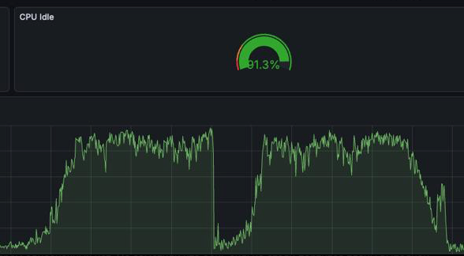
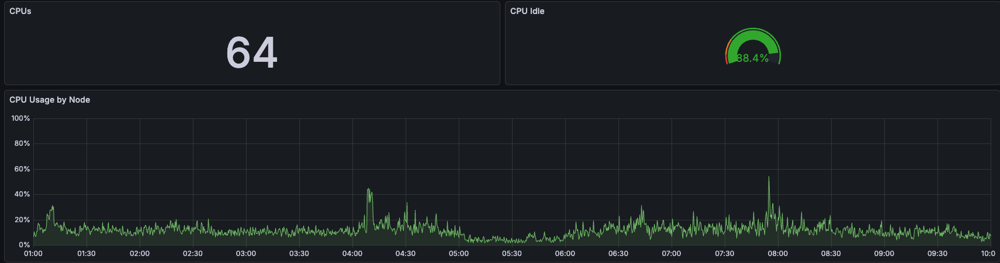

# fasttrun

PostgreSQL extension for PostgreSQL 16, PostgreSQL 17 and PostgreSQL 18.

Fast `TRUNCATE` and `ANALYZE` for temporary tables — **without a single invalidation message** in the shared queue (sinval).

## Why

In large PL/pgSQL calculations, temporary tables are used as intermediate buffers: create → fill → compute → clear → fill again. Every `TRUNCATE` in PostgreSQL goes through `smgrtruncate` → `CacheInvalidateSmgr` and puts a message into the shared invalidation queue (sinval). And every `ANALYZE` is even worse: it writes to `pg_class` and `pg_statistic`, generating dozens of sinval messages per table.

When 50-100 backends run this cycle in parallel — thousands of `TRUNCATE` and `ANALYZE` per second — the sinval queue (4096 slots) overflows. Each backend, on any catalog access, is forced to process the entire accumulated queue via `ReceiveSharedInvalidMessages`, with 99% of messages referring to other backends' temp tables and being useless to us. On a server with 60+ cores, this turns into an O(N²) spiral and eats all the CPU.

This fasttrun fork tries to solve both problems:
* **`fasttruncate`** — physical cleanup via direct `unlink` + `smgrcreate`, bypassing `smgrtruncate`. Zero sinval.
* **`fasttrun_analyze`** — row counting and column statistics collection only in the current process memory. Zero catalog writes, zero sinval. Maximum "similarity" to regular `ANALYZE`.

## Functions

| Function | What it does | sinval? |
|---|---|---|
| `fasttruncate(text)` | Clears a temporary table (heap + indexes + toast) | **no** |
| `fasttrun_analyze(text)` | Publishes `relpages/reltuples` + collects column statistics | **no** |
| `fasttrun_analyze_bulk(VARIADIC text[])` | Batch variant of `fasttrun_analyze` for several tables in one call. Plan-cache invalidation is emitted inline per table, and each one makes the core walk the whole cached-plan list (`PlanCacheRelCallback`): N tables — N walks. The only saving is per-plan: a plan already marked `is_valid=false` by an earlier invalidation in the batch is skipped cheaply instead of re-marked. Useful in loops touching many temp tables per transaction. | **no** |
| `fasttrun_collect_stats(text)` | Explicit column statistics collection. In 99% of cases `fasttrun_analyze` is enough — it does the same automatically on the first pass. This function is needed only if auto-collection is disabled (`auto_collect_stats=off`) or you want to force a rebuild | **no** |
| `fasttrun_relstats(text)` | Returns current `relpages/reltuples` from process memory | **no** |
| `fasttrun_inspect_stats(text)` | Returns cached statsTuple in `pg_statistic` format (for debugging) | **no** |
| `fasttrun_cache_stats()` | Capacity monitoring with six `bigint` fields: `analyze_entries`, `column_stats_relid_entries`, `column_stats_entries`, `analyze_bytes`, `column_stats_bytes`, `total_bytes`. The first three count entries, the next two report recursively allocated bytes in each context, and `total_bytes` is their sum. The function does not modify catalogs or take locks itself; missing caches read as zeroes | **no** |
| `fasttrun_hot_temp_tables(n)` | Top-N most frequently created temp tables (requires `shared_preload_libraries`) | **no** |
| `fasttrun_prewarm()` | Creates top-N hot temp tables via `create_temp_table` | **no** |
| `fasttrun_reset_temp_stats()` | Resets temp table creation counters | **no** |

The public API contains 10 SQL functions.

Functions that accept a temporary table name:
* accept a local temporary heap table name (schema-qualified is allowed);
* silently return an empty result if the table does not exist;
* raise an error if the table is not temporary.

Only local temporary heap tables are supported. `fasttruncate`,
`fasttrun_analyze`, `fasttrun_analyze_bulk` and `fasttrun_collect_stats`
reject partitioned tables and inheritance parents with an error: local
stats for a parent would hide core inherited statistics during planning.
Foreign keys are not checked, `TRUNCATE ... CASCADE` is not supported,
and SERIAL/IDENTITY sequences are not reset.

## How fasttruncate works

By default (`fasttrun.zero_sinval_truncate = on`) the physical cleanup goes through `unlink` of all fork files + a fresh `smgrcreate`. This does **not** call `CacheInvalidateSmgr` — unlike the standard `smgrtruncate`.

Safe because temporary tables live in the backend's local buffer pool. Other processes don't see our relfilenode, and invalidation is useless to them.

At the same time, `fasttruncate` invalidates plans for this table only in the
current server process. This prevents PL/pgSQL and SPI from reusing an old plan
after cleanup and refill. Global `ResetPlanCache` is not called, and no shared
invalidation messages are sent.

Besides the table itself, `fasttruncate` handles:
* **all user indexes, the TOAST table, and its indexes** — every relation is
  opened before any file is changed. If that fails, the data remains intact.
  The function then clears user indexes, TOAST indexes, the TOAST table, and
  the main table. Finally, `ambuild` creates empty indexes and the statistics
  are reset;
* **`rd_amcache`** — clears the index AM metadata cache;
* **`smgr_cached_nblocks`** — invalidated after ambuild;
* **analyze cache** — seeds the baseline for delta math.

An error before the first file change rolls back normally. Once cleanup has
started, the old files cannot be restored. fasttrun then blocks the table and
returns SQLSTATE `55000` for SELECT, DML, COPY, planning, and extension
functions. A successful retry, DROP and recreate, or `DISCARD TEMP/ALL` clears
the block. A savepoint rollback or full ROLLBACK does not.

Before cleanup, `CheckTableNotInUse` is called — the same check that regular SQL `TRUNCATE` does. If there is an open cursor or an active query on the table, you get a clear SQL error, not a PANIC.

PostgreSQL handles errors inside `RelationTruncate` itself and raises `PANIC`.
The extension cannot safely catch such an error and continue the current
server process.

Set `fasttrun.zero_sinval_truncate = off` to use the fallback path. It keeps
the same order but calls `RelationTruncate` separately for each relation. Each
completed call emits one shared SMGR message: one for the main table, one for
each user index, and optional messages for the TOAST table and its indexes.
The default path emits none.

## How fasttrun_analyze works

### Hot path (delta math)

On a repeat call, the function doesn't scan the table but computes the row count from pgstat counters:

```
new_tuples = cached_tuples + (ins_now - cached_ins) - (del_now - cached_del)
```

Cost: **~1 microsecond**. A hash table lookup + three subtractions + a write to `rd_rel`.

### Cold path (full scan)

Triggers on the first call or when the delta is invalid. Fully walks the heap, counts rows and (if `auto_collect_stats = on`) simultaneously samples for column statistics.

### Column statistics refresh

If after the previous collection the DML change ratio exceeded `stats_refresh_threshold` (20% by default), the same full reservoir sample as the cold path is launched. This is more expensive than the old block refresh, but keeps plan quality aligned with regular `ANALYZE` on clustered and sparse heaps.

Partial indexes: their `reltuples` is re-sampled on any new DML since the last rescan — no threshold applies, because predicate selectivity is unpredictable (flipping a boolean flag on 1% of rows can double the index). Repeated `fasttrun_analyze` calls without new DML do not repeat the rescan.

### Statistics quality

By default (`use_typanalyze = on`) the extension calls **the same** `std_typanalyze` / type-specific `typanalyze` from the PostgreSQL core for regular heap-table columns. It collects MCV, histogram, correlation and type-specific stats; it also honors `ALTER COLUMN SET STATISTICS 0` and `ALTER COLUMN SET (n_distinct = ...)`.

The main difference is sample size. Default `sample_rows = 3000` is ~10x smaller than regular `ANALYZE`. For the closest match — `SET fasttrun.sample_rows = -1`.

There are deliberate boundaries: extended statistics, expression-index statistics and inherited-table statistics are not collected; ACL/RLS/security-barrier behavior of regular `ANALYZE` is not reproduced. The extension is designed for session-local temp tables owned by the current backend.

`relpages/reltuples/relallvisible` and column statistics live in backend memory and survive `COMMIT`; xact-local delta state is cleared at transaction boundaries. After DML below `stats_refresh_threshold` cached column stats stay visible to the planner (soft freshness, like core PG between ANALYZE runs); past the threshold they are hidden until a refresh.

When local statistics are stale or reset, fasttrun hides old `pg_statistic`
rows and uses a safe type-based value for column width. With
`track_counts=off`, it cannot verify freshness, so it publishes only table
statistics and hides column statistics. Collect statistics again after
enabling the counters.

The hiding is covered in the reverse direction too: if a plan was built while
column stats were hidden by the freshness gate after DML (the planner saw
defaults), rolling that DML back — `ROLLBACK` or `ROLLBACK TO SAVEPOINT` —
invalidates such plans locally: the stats are visible again, and the
defaults-based plan is stale. The dependency is recorded only when the planner
actually consults the hidden stats during planning; with `track_counts = off`
it never arises.

Regular `ANALYZE` gives statistics ownership back to PostgreSQL. A full call
removes local statistics for every column; `ANALYZE table (col1, ...)` removes
them only for the listed columns. Plain `VACUUM` changes nothing. A table
rewrite hides local statistics until the next collection.

A separate commit-boundary backstop: a temp table's pgstat counters reset at every transaction (temp is never flushed to shared pgstat), so a plain SQL refill of a temp table in a separate transaction without a `fasttrun_analyze` call is invisible to the freshness counters. To keep such a refill from serving stale MCV/n_distinct to the planner, freshness is additionally anchored to physical size: if the block count changed by an order of magnitude (>=3x or <=1/3) since collection, cached column stats are hidden. The signal is coarse (bloat-contaminated), so it only catches an outright refill; a same-size refill with a different distribution committed without `fasttrun_analyze` is not caught — call `fasttrun_analyze` after refilling, as intended.

## Settings (GUC)

| Parameter | Default | Description |
|---|---|---|
| `fasttrun.auto_collect_stats` | `on` | Collect column statistics during cold `fasttrun_analyze` pass |
| `fasttrun.sample_rows` | `3000` | Sample size. `0` — disable column stats collection; relation-level relstats for the heap and regular indexes are still updated. `-1` — auto (same as regular `ANALYZE`) |
| `fasttrun.use_typanalyze` | `on` | Use `std_typanalyze` from core (MCV/histogram/correlation). `off` — only n_distinct/null_frac/width (excessively wide varlena > 1024 bytes are not detoasted, counted as distinct — like core's `WIDTH_THRESHOLD`, guards against OOM on TOAST columns) |
| `fasttrun.max_analyze_pages` | `100000` | Heap-page threshold (~800 MB) above which a cold `fasttrun_analyze` switches from a full scan to block sampling: it reads a bounded random block sample and ESTIMATES reltuples from tuple density (like a regular `ANALYZE`), keeping cost O(sample) instead of O(table) on anomalously giant temp tables. Column stats are collected from the same sample. The threshold covers every analyze scan — cold, delta-refresh after churn and the partial-index rescan, not just the first one. `0` — always do the exact full scan |
| `fasttrun.stats_refresh_threshold` | `0.2` | DML change ratio threshold governing both stats refresh and freshness tolerance: below it cached column stats stay visible to the planner, past it they are hidden. For freshness the effective threshold scales with column cardinality (`threshold·(1−dratio)`, floored at 5%): near-unique columns are stricter (guarding against a stale skewed estimate), low-cardinality columns keep the full threshold. A visible→hidden flip observed by `fasttrun_analyze` (including in the band between the scaled floor and the refresh threshold) invalidates cached SPI/PREPARE plans — a plan built on the now-hidden distribution does not outlive the flip while new plans already see defaults. `0` — refresh on any DML, visible only on an exact counter match. `1` — auto refresh disabled, freshness tolerates churn up to 100% (subject to the scaling) |
| `fasttrun.invalidate_threshold` | `0.2` | `relpages`/`reltuples` drift ratio below which `fasttrun_analyze` does NOT invalidate cached SPI/PREPARE plans. Drift is measured cumulatively — against the values published at the last invalidation, not against the previous call: a series of small steps, each below the threshold, still invalidates the plan once the accumulated drift reaches it. Symmetric with `stats_refresh_threshold` — below 20% DML neither refresh nor plan invalidation fires. `0` — invalidate on any drift (the 2.2.0 behaviour). Invalidations triggered by a column-stats refresh, a stats-visibility flip, or an index relstats change always fire, regardless of this threshold |
| `fasttrun.zero_sinval_truncate` | `on` | `on` clears files directly and sends no shared SMGR messages. `off` calls `RelationTruncate` for each relation and sends one message after each successful call |
| `fasttrun.max_stats_memory` | `0` | Soft memory guard for the column-stats cache (in KB; `0` = unlimited). Before the first collection for a new table, only `column_stats_bytes` is compared with the limit. Equality is admitted, so that first table may overshoot; later new tables are blocked once the current size is already above the limit. `analyze_bytes` is not part of this budget. A blocked table behaves as with `auto_collect_stats = off`: relation-level relstats keep working and the planner uses default selectivity. Auto-collection warns once per backend; explicit `fasttrun_collect_stats` emits a `NOTICE` on every call. Tables with existing statistics keep refreshing; there is no eviction or LRU. `fasttrun_cache_stats()` reports the current sizes |

## Performance

PostgreSQL 16, macOS arm64, single backend:

```
Scenario                                         Time

fasttruncate (no indexes)                         ~450 us
fasttruncate (1 btree index)                      ~640 us
fasttruncate (toast)                              ~400 us
fasttrun_analyze, hot path (100k rows)              ~1 us
fasttrun_analyze + INSERT (50k rows)              ~1.8 us
fasttrun_analyze vs ANALYZE (4 columns)           ~230x faster
planner hooks (caches active)                  ~+0.26 us per planning
```

Under load the gap is even wider — regular `ANALYZE` forces all other backends to drain the sinval queue, while `fasttrun_analyze` puts nothing into it.

Queries without temporary tables are not affected: the observable impact is zero — identical plans and results, zero replans, zero memory growth (pinned by the `check-no-temp-impact` check). The `planner_hook` entry itself does run on every planning cycle and costs a fraction of a microsecond with a live cache — the "planner hooks" row in the table above.

## Production impact

One of our production clusters (64 CPU, 75+ backends, thousands of `CREATE TEMP TABLE` per day) before the fasttrun rework:



As you can see, CPU is under heavy pressure — the cluster was burning cycles draining the sinval queue in `ReceiveSharedInvalidMessages`. After the fasttrun rewrite (`fasttruncate` + `fasttrun_analyze`):



Same workload, same hardware: CPU idle stays around ~88%, per-node peaks don't exceed 40%. The numbers match the expectation from the description above — kill the sinval storm and you're left with the useful CPU budget.

## Installation

```bash
make PG_CONFIG=/path/to/pg_config
make install PG_CONFIG=/path/to/pg_config
```

```sql
CREATE EXTENSION fasttrun;
```

By default, this installs version `2.4.0`.

Upgrade from older versions `2.0` / `2.1` / `2.1.1` / `2.1.2` / `2.2.0` /
`2.3.0` / `2.3.1` / `2.3.2` / `2.3.3` / `2.3.4` is supported:
```sql
ALTER EXTENSION fasttrun UPDATE;
```

## Tests

```bash
make installcheck PG_CONFIG=/path/to/pg_config PGPORT=5433
```

13 test cases via `pg_regress`:

| Test | What it checks |
|---|---|
| `fasttrun_basic` | Basic operation, indexes (btree/hash/GIN/expression/partial), toast, active cursor |
| `fasttrun_silent` | Silent behavior on non-existent / non-temp tables |
| `fasttrun_stats_reset` | `relpages/reltuples` reset after fasttruncate |
| `fasttrun_analyze` | Delta math, savepoint rollback, TRUNCATE inside a transaction |
| `fasttrun_migration` | Upgrade path 2.0 -> latest, including backward compatibility with `fasttruncate_c` |
| `fasttrun_bench` | Synthetic benchmark on 1M rows x 50 columns |
| `fasttrun_stats` | Statistics hook: EXPLAIN before/after, auto-collection, sample_rows=0/-1, refresh threshold, DDL/TRUNCATE eviction, partial-index relstats, all six `fasttrun_cache_stats()` fields, and first admission exactly at the memory threshold |
| `fasttrun_tracking` | Tracking frequently created temp tables and prewarm; has expected output for both `shared_preload_libraries` and non-preload modes |
| `fasttrun_relstats_survive` | relstats survive relcache rebuilds and `COMMIT` inside one backend, including tables referenced only from SubLink subqueries |
| `fasttrun_plan_cache_survive` | Backend-local SPI/PL/pgSQL plan cache invalidation after fasttruncate, analyze, collect_stats and savepoint rollback |
| `fasttrun_stats_width` | Correct `stawidth` for by-value / varlena / fixed-length by-reference columns |
| `fasttrun_discard` | Cache eviction on `DISCARD TEMP/ALL` and dependency drops (`DROP ... CASCADE`), drop rollback inside a savepoint |
| `fasttrun_zero_sinval_catalog` | Checks that extension functions leave `pg_class`, `pg_statistic`, and relfilenodes unchanged; regular `TRUNCATE` and `ANALYZE` verify that the check detects catalog changes |

All 13 `pg_regress` tests pass on PostgreSQL 16, 17, and 18.

Before release, `scripts/check_cassert_allversions.sh` rebuilds the extension
with `--enable-cassert` for all three versions. Each run must pass 13 of 13
tests with no `TRAP`; the separate fault, ordering, memory, planner,
publication, and tracking-file persistence checks must pass as well.

For a separate Linux-only check of the "zero shared sinval" contract, run the `gdb` smoke test:

```bash
PG_CONFIG=/path/to/pg_config scripts/check_zero_shared_sinval.sh
```

The script attaches to a server process and counts calls to
`SIInsertDataEntries` and `SendSharedInvalidMessages`. Regular `ANALYZE`
confirms that the counter works; `fasttrun_analyze`,
`fasttrun_collect_stats`, and `fasttruncate` must not send shared messages.
On Ubuntu you may need to allow the attachment temporarily:
`sudo sysctl -w kernel.yama.ptrace_scope=0`.

After `make install`, additional Linux test scripts are available:

```bash
make check-parity PG_CONFIG=/path/to/pg_config
make check-soak PG_CONFIG=/path/to/pg_config
make check-perf-smoke PG_CONFIG=/path/to/pg_config
make check-hook-chain PG_CONFIG=/path/to/pg_config
make check-zero-sinval PG_CONFIG=/path/to/pg_config
make check-fault-matrix PG_CONFIG=/path/to/pg_config
make check-xact-journal-memory PG_CONFIG=/path/to/pg_config
make check-no-temp-impact PG_CONFIG=/path/to/pg_config
make check-tracking-persistence PG_CONFIG=/path/to/pg_config
make check-docs
```

`check-parity` runs `scripts/check_fasttrun_analyze_parity.py` in two modes:

| Mode | Settings | What it proves |
|---|---|---|
| `full` | `fasttrun.sample_rows = -1`, `fasttrun.stats_refresh_threshold = 0` | Plans closest to regular `ANALYZE` |
| `default` | default fasttrun settings | Acceptable estimates for supported cases |

The script compares `EXPLAIN (FORMAT JSON)` after regular `ANALYZE` and after
`fasttrun_analyze`. Exact matches are not required because random samples may
differ. The test checks that `Plan Rows` estimates stay within allowed bounds.

Other checks:

| Check | What it does |
|---|---|
| `check-soak` | Repeatedly creates, analyzes, and drops a temporary table in one server process, then checks memory |
| `check-perf-smoke` | Checks the `bpftrace` attachment, the main fasttrun path, and queries on permanent tables |
| `check-hook-chain` | Tests both hook orders with the bundled test module; an installed third-party extension is used when available |
| `check-zero-sinval` | Uses `gdb` to check that no shared invalidation messages are sent |
| `check-fault-matrix` | Simulates an error at each file-cleanup step and checks recovery |
| `check-xact-journal-memory` | Checks transaction and subtransaction journals, cleanup state, and memory |
| `check-no-temp-impact` | Compares plans, results, replans, memory, and planning time for permanent-table queries |
| `check-giant-temp` | Checks the 1M x 50 table and the block-sampling limit |
| `check-tracking-persistence` | Runs `scripts/check_fasttrun_tracking_persistence.sh`: a real table created with `LIKE dummy_tmp.*` exercises clean save/restart/load in release and cassert builds; write, close, and pre-rename failures run on cassert builds |
| `check_cassert_allversions.sh` | Runs all checks on PostgreSQL 16, 17, and 18 with assertions enabled |
| `check-docs` | Checks documentation against project metadata |
| `check-replace-catalog` | Checks that the replacement script does not change SQL strings or comments |

The full local set can be run with one target:

```bash
make check-deep-local PG_CONFIG=/path/to/pg_config
```

## Usage pattern

An example `create_temp_table` function that creates a temp table from a template or clears it via `fasttruncate` is in `examples/create_temp_table.sql`. Adapt it to your project.

Temporary table lifecycle in production with a connection pooler:

```sql
-- 1. Create the table (or clear if it already exists from the previous client)
--    create_temp_table internally calls fasttruncate if the table exists
PERFORM create_temp_table('temp_xxx');

-- 2. Fill with data
INSERT INTO temp_xxx SELECT ... FROM big_table WHERE ...;

-- 3. Update statistics for the planner (instead of ANALYZE temp_xxx)
--    On the first call — full scan + column stats collection.
--    On repeat calls — delta math for ~1 microsecond.
PERFORM fasttrun_analyze('temp_xxx');

-- 4. Work — the planner sees correct relpages/reltuples/n_distinct
SELECT ... FROM temp_xxx JOIN another_table ON ...;

-- 5. Clear before the next cycle (or before the next pooler client)
--    Also seeds the baseline for delta math.
PERFORM fasttruncate('temp_xxx');

-- Then the cycle repeats from step 2
```

In a typical PL/pgSQL calculation, one backend works with 10-30 temporary tables, each going through this cycle many times. With a pooler (pg_doorman, odyssey) the backend lives long and serves hundreds of clients in a row — temporary tables accumulate and get reused. `fasttruncate` resets data and statistics so the next client doesn't inherit anything from the previous one.

Statistics memory is split between the analyze cache and the column-stats cache. `fasttrun_cache_stats()` reports `analyze_entries`, `column_stats_relid_entries`, `column_stats_entries`, `analyze_bytes`, `column_stats_bytes`, and `total_bytes`; byte counts include child contexts and the total is the sum of both parts. One copied `pg_statistic` row (MCV + histogram at `default_statistics_target = 100`) typically takes 1-3 KB, so hundreds of temporary tables per backend can consume tens of MB per connection. `fasttrun.max_stats_memory` compares only `column_stats_bytes` before first admission: equality is allowed and may overshoot once, after which new tables remain without column stats. Already managed tables keep refreshing; there is no eviction or LRU. Recycling pooler connections releases both caches. With a densely packed pool, factor this per-backend memory into the pool's RAM budget — allow for tens of MB per server connection.

## Hot table prewarming

When working with a pooler, a backend serves hundreds of clients. Each client can use dozens of temporary tables. If you have thousands of templates in the database, creating all of them on backend startup is slow and generates sinval. Instead, fasttrun can track which temp tables are created most often and prewarm only the hottest ones.

A sinval caveat: prewarming creates tables with a plain `CREATE TEMP TABLE` — regular DDL with the usual catalog invalidation messages. The zero-sinval contract of fasttrun covers `fasttruncate` / `fasttrun_analyze` / `fasttrun_collect_stats`, not table creation (prewarm included). The win of prewarming is creating fewer tables (top-N instead of all), not making their creation free.

### How to enable

Add fasttrun to `shared_preload_libraries` **as the last entry**:

```ini
# postgresql.conf
shared_preload_libraries = 'ptrack,citus_columnar,timescaledb,...,fasttrun'
```

Restart PostgreSQL. You need this once — fasttrun will allocate a chunk of shared memory for the counters.

> **Why last.** fasttrun registers a `planner_hook` that re-injects `relpages`/`reltuples` for temp tables into `rd_rel` before planning. In the PostgreSQL hook chain the extension loaded last runs first — so the stats are refreshed before Citus, TimescaleDB, pgpro_stats or other planners read them. Loading fasttrun earlier still works, but those extensions may read stale `rd_rel` values before our hook fires.

### What if you don't enable it

All core extension functions (`fasttruncate`, `fasttrun_analyze`, etc.) work fine — they don't need `shared_preload_libraries`. Only the tracking functions (`fasttrun_hot_temp_tables`, `fasttrun_prewarm`, `fasttrun_reset_temp_stats`) will return an empty result / zero. No errors.

### How to use

```sql
-- See the top 20 most frequently created temp tables:
SELECT * FROM fasttrun_hot_temp_tables(20);
 relname          | create_count | last_create
------------------+--------------+----------------------------
 temp_calc_main   |         1523 | 2026-04-11 12:34:56.789+03
 temp_payment_buf |          892 | 2026-04-11 12:34:55.123+03
 ...

-- Prewarm the hot tables on session start:
SELECT fasttrun_prewarm();
 fasttrun_prewarm
------------------
              127

-- Reset statistics (e.g. after a deploy with new tables):
SELECT fasttrun_reset_temp_stats();
```

`fasttrun_prewarm()` selects the N most frequently created tables. N is set by
`fasttrun.prewarm_count` and defaults to 1000; setting it to `0` disables
prewarming. The function calls `create_temp_table()` for each selected table,
or clears it with `fasttruncate` if it already exists. A table is skipped
without error when `fasttrun.prewarm_schema` has no matching template.

**What goes into statistics**: only tables created via `CREATE TEMP TABLE ... (LIKE dummy_tmp.xxx ...)`. If a developer creates a temp table directly (`CREATE TEMP TABLE foo (id int, ...)`), without LIKE from the template schema — it does not go into statistics and does not interfere with prewarming.

Typical pooler integration — call `fasttrun_prewarm()` when the pooler creates a new physical connection. Especially useful when the pooler supports `min_pool_size` and keeps a certain number of connections ahead of time — then all pool backends start up already prewarmed.

### Settings

| Parameter | Default | Description |
|---|---|---|
| `fasttrun.track_temp_creates` | `on` | Count CREATE TEMP TABLE. Can be disabled via SET for debugging |
| `fasttrun.prewarm_count` | `1000` | How many hot tables to create in `fasttrun_prewarm()`; `0` disables prewarming completely |
| `fasttrun.prewarm_schema` | `dummy_tmp` | Template schema. Only CREATE with LIKE from this schema are tracked |
| `fasttrun.track_schedule` | `'mon-fri 08:00-18:00'` | Tracking schedule. Empty means always. Format described below |

### Tracking schedule

By default fasttrun tracks creates on weekdays from 08:00 to 18:00
(`mon-fri 08:00-18:00`). An empty string enables round-the-clock tracking. This
schedule prevents tables used only by nightly jobs from displacing the tables
needed by daytime traffic.

The `fasttrun.track_schedule` GUC lets you configure a "window" when tracking is active:

```ini
# Weekdays only, 8 to 18
fasttrun.track_schedule = 'mon-fri 08:00-18:00'

# Weekdays plus half Saturday
fasttrun.track_schedule = 'mon-fri 08:00-18:00; sat 10:00-14:00'

# Specific days only
fasttrun.track_schedule = 'mon,wed,fri 09:00-17:00'

# Empty — always on
fasttrun.track_schedule = ''
```

**Format:**
- Day names: `mon`, `tue`, `wed`, `thu`, `fri`, `sat`, `sun` (case-insensitive)
- Day range via `-`: `mon-fri`
- Day list via `,`: `mon,wed,fri`
- Time `HH:MM-HH:MM` in 24-hour format
- Multiple windows separated by `;`
- Up to 8 windows
- Windows crossing midnight are not supported — split into two: `fri 22:00-23:59; sat 00:00-02:00`

**On parse error**: a WARNING is logged, tracking behaves as if no schedule is set (always active). This is safe by design — never silently disables tracking.

**Time is checked against the server timezone** (`log_timezone`). The hook check is one pass over the windows array, ~100 nanoseconds, unnoticeable.

Can be changed on the fly via `SET fasttrun.track_schedule = '...'` (superuser only).

### Persistence

Statistics are saved to disk (`pg_stat/fasttrun_temp_stats`) on server shutdown and loaded on startup. So counters are not lost after a PostgreSQL restart.

## Limitations

* **Heap AM only** — checked on entry of all functions. For columnar and other exotica — an error.
* **Flat temporary heap tables only** — partitioned tables and inheritance parents are rejected before files are changed. Foreign keys are not checked and `TRUNCATE ... CASCADE` is not supported.
* **Not transactional** — ROLLBACK does not restore files that were already cleared. If cleanup fails midway, the table remains blocked until another `fasttruncate` or DROP.
* **After `fasttruncate` the table publishes `reltuples = 0`** — core `TRUNCATE` sets the `-1` sentinel, which for a small not-yet-analyzed table enables the 10-page minimum size estimate (a guard against premature nested loops). So always call `fasttrun_analyze` after a refill: refilling a small table without analyze yields more aggressive estimates than core PostgreSQL.
* **`track_counts = on` is required for column stats freshness** — without pgstat counters the extension updates only relation-level statistics, emits a WARNING once per backend, and does not return cached column stats to the planner.
* **Extended statistics** (`CREATE STATISTICS`) — not supported, there is no suitable hook in the core.
* **Inheritance stats** — not supported. Temporary work tables normally do not use this path.
* **Sequences** — `fasttruncate` does not reset SERIAL/IDENTITY sequences (same as regular `TRUNCATE` without `RESTART IDENTITY`).
* **Cache is session-local only** — reused across transactions in one backend, but not across reconnects and never written to catalogs.
* **A full `ROLLBACK` does not restore cleared data** — after a successful `fasttruncate`, the table and its statistics stay empty. After an error, the block remains until repair or DROP.
* **Expression index statistics** — not collected by `fasttrun_analyze`. Regular btree indexes on table columns use the column statistics, but indexes like `CREATE INDEX ON t ((lower(name)))` get no separate expression statistics. If a core `ANALYZE` ever ran on such a table, the stale catalog expression statistics are hidden for tables managed by fasttrun: expression predicates get default planner estimates until the next core `ANALYZE`.
* **ACL/RLS/security-barrier semantics of ANALYZE are not reproduced** — the extension is meant for temporary tables in the current session, not as a general security boundary.
* **Plans are invalidated only in the current server process** — `PlanCacheRelCallback` is called for each table. Global `ResetPlanCache` and shared invalidation messages are not used. `DISCARD TEMP/ALL` and dependency drops remove entries for deleted tables.
* **`TRUNCATE` with dependencies is not supported** — the extension handles only explicitly listed tables. Use regular PostgreSQL `TRUNCATE` for inheritance, partitioning, and foreign keys with `CASCADE`.
* **Cost of cold-path stats collection** — ~50-150 ms for a 1M rows x 50 columns table. Can be disabled via GUC.

## Compatibility

| PostgreSQL | Build | Tests |
|---|---|---|
| PostgreSQL 16 | yes | yes |
| PostgreSQL 17 | yes | yes |
| PostgreSQL 18 | yes | yes |

Single source file, version differences handled via `#if PG_VERSION_NUM`.

## File structure

```
fasttrun.c                    # main C code
fasttrun.control              # extension metadata
fasttrun--2.4.0.sql           # current version (10 functions)
fasttrun--2.3.4.sql           # frozen previous version (9 functions)
fasttrun--2.3.0.sql           # older version
fasttrun--2.3.1.sql           # previous version
fasttrun--2.3.2.sql           # previous version
fasttrun--2.3.3.sql           # previous version
fasttrun--2.2.0.sql           # older version
fasttrun--2.0.sql             # old base version
fasttrun--2.0--2.1.sql        # migration 2.0 -> 2.1
fasttrun--2.1--2.1.1.sql      # migration 2.1 -> 2.1.1
fasttrun--2.1.1--2.1.2.sql    # migration 2.1.1 -> 2.1.2
fasttrun--2.1.2--2.2.0.sql    # migration 2.1.2 -> 2.2.0
fasttrun--2.2.0--2.3.0.sql    # migration 2.2.0 -> 2.3.0 (new SQL function + C-side fixes)
fasttrun--2.3.0--2.3.1.sql    # migration 2.3.0 -> 2.3.1 (C-side fixes only, no SQL changes)
fasttrun--2.3.1--2.3.2.sql    # migration 2.3.1 -> 2.3.2 (C-side fixes only, no SQL changes)
fasttrun--2.3.2--2.3.3.sql    # migration 2.3.2 -> 2.3.3 (C-side fixes only, no SQL changes)
fasttrun--2.3.3--2.3.4.sql    # migration 2.3.3 -> 2.3.4 (C-side fixes only, no SQL changes)
fasttrun--2.3.4--2.4.0.sql    # migration 2.3.4 -> 2.4.0 (cache telemetry)
Makefile                      # PGXS
examples/                     # examples (create_temp_table)
scripts/check_fasttrun_tracking_persistence.sh  # clean and fault-safe tracking-file persistence
sql/                          # 13 pg_regress tests
expected/                     # expected output
```
